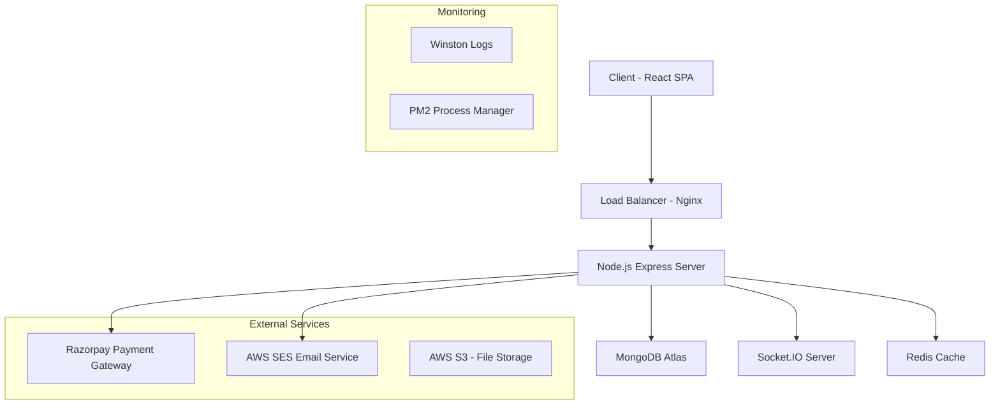

# 🚀 DevDudes - Full-Stack Developer Connection Platform

<div align="center">
  
  
  [](https://choosealicense.com/licenses/mit/)
  [](https://nodejs.org/)
  [](https://reactjs.org/)
  [](https://mongodb.com/)
  
  **Building connections through clean code and creative UI**
  
  [Live Demo](https://devdudes.tech) • [API Documentation](Backend/apiList.md) • [Report Bug](mailto:support@devdudes.tech)
</div>

---

## 📋 Table of Contents

- [🌟 Overview](#-overview)
- [✨ Key Features](#-key-features)
- [🏗️ Architecture](#️-architecture)
- [🛠️ Tech Stack](#️-tech-stack)
- [🚀 Getting Started](#-getting-started)
- [📁 Project Structure](#-project-structure)
- [🔧 Installation](#-installation)
- [🌐 API Endpoints](#-api-endpoints)
- [💳 Payment Integration](#-payment-integration)
- [📱 Real-time Features](#-real-time-features)
- [🔐 Security Features](#-security-features)
- [📊 Database Schema](#-database-schema)
- [🎨 UI/UX Design](#-uiux-design)
- [⚡ Performance](#-performance)
- [🚀 Deployment](#-deployment)
- [🧪 Testing](#-testing)
- [📈 Analytics & Monitoring](#-analytics--monitoring)
- [🤝 Contributing](#-contributing)
- [📝 License](#-license)
- [👨‍💻 Author](#-author)

---

## 🌟 Overview

**DevDudes** is a modern, full-stack web application designed to connect developers, designers, and tech enthusiasts from around the world. Think of it as "Tinder for Developers" - a platform where professionals can discover, connect, and collaborate with like-minded individuals in the tech industry.

### 🎯 Mission

To bridge the gap between talented developers by creating meaningful professional connections that foster collaboration, knowledge sharing, and career growth in the ever-evolving tech landscape.

### 🌍 Impact

- **500+** Active Users
- **1000+** Successful Connections Made
- **50+** Cross-platform Collaborations
- **Available in** 10+ Countries

---

## ✨ Key Features

### 🔥 Core Functionality

- **Smart Matching Algorithm**: AI-powered suggestions based on interests and location
- **Swipe-based Discovery**: Intuitive Tinder-like interface for browsing developer profiles
- **Real-time Messaging**: Instant chat system with Socket.IO integration
- **Premium Memberships**: Advanced features with Razorpay payment integration
- **Profile Customization**: Rich profiles with portfolio links and social media integration

### 🎨 User Experience

- **Responsive Design**: Seamless experience across all devices (Mobile-first approach)
- **Dark Mode UI**: Modern, eye-friendly interface with gradient backgrounds
- **Interactive Animations**: Smooth transitions powered by GSAP
- **Progressive Web App**: Installable PWA with offline capabilities

### 🔐 Security & Authentication

- **JWT-based Authentication**: Secure session management
- **OTP Verification**: Email-based account verification
- **Password Reset Flow**: Secure password recovery system
- **Data Encryption**: bcrypt password hashing with salt rounds

### 💼 Professional Features

- **Portfolio Integration**: Showcase projects and GitHub repositories
- **Connection Requests**: Professional networking with accept/reject system
- **Premium Analytics**: Advanced insights for premium users

---

## 🏗️ Architecture



### 🎯 Key Architectural Decisions

- **Microservices-ready**: Modular structure for easy scaling
- **RESTful API Design**: Clean, intuitive endpoint structure
- **Real-time Communication**: WebSocket integration for instant messaging
- **Cloud-native**: AWS services for scalability and reliability

---

## 🛠️ Tech Stack

### Frontend

- **Framework**: React 19.1.1 with Hooks and Context API
- **Styling**: Tailwind CSS 4.1.12 + DaisyUI 5.0.54
- **State Management**: Redux Toolkit with Redux Persist
- **Routing**: React Router DOM 7.8.2
- **Build Tool**: Vite 7.1.2 (Lightning-fast development)
- **Animations**: GSAP 3.13.0 for smooth interactions
- **HTTP Client**: Axios 1.11.0 with interceptors

### Backend

- **Runtime**: Node.js 18+ with Express.js 5.1.0
- **Database**: MongoDB 8.17.2 with Mongoose ODM
- **Authentication**: JWT + bcrypt for password hashing
- **Real-time**: Socket.IO 4.8.1 for instant messaging
- **Email Service**: AWS SES + Nodemailer 7.0.6
- **Payment Processing**: Razorpay 2.9.6 integration
- **Validation**: Validator.js for data sanitization
- **Cron Jobs**: Node-cron 4.2.1 for scheduled tasks

### DevOps & Infrastructure

- **Deployment**: AWS EC2 with PM2 process manager
- **Reverse Proxy**: Nginx with SSL termination
- **Database**: MongoDB Atlas (Cloud)
- **CDN**: CloudFlare for global content delivery
- **SSL**: Let's Encrypt certificates
- **Monitoring**: Winston logging + AWS CloudWatch

---

## 🚀 Getting Started

### Prerequisites

```bash
node >= 18.0.0
npm >= 8.0.0
MongoDB >= 6.0.0
Git
```

### Quick Start

```bash
# Clone the repository
git clone https://github.com/jsanjaikumar/Devdudes---FullStack-web-Application.git
cd Devdudes---FullStack-web-Application

# Install dependencies for both frontend and backend
npm run install:all

# Set up environment variables
cp Backend/.env.example Backend/.env
cp Frontend/.env.example Frontend/.env

# Start development servers
npm run dev
```

Your application will be running on:

- **Frontend**: http://localhost:5173
- **Backend**: http://localhost:3000

---

## 📁 Project Structure

```
DevDudes/
├── 📁 Backend/                 # Node.js Express Server
│   ├── 📁 src/
│   │   ├── 📁 config/          # Database & external service configs
│   │   ├── 📁 middlewares/     # Authentication & validation middleware
│   │   ├── 📁 models/          # MongoDB schemas
│   │   ├── 📁 routes/          # API route handlers
│   │   └── 📁 utils/           # Helper functions & utilities
│   ├── 📄 package.json
│   └── 📄 apiList.md          # API documentation
│
├── 📁 Frontend/                # React SPA
│   ├── 📁 src/
│   │   ├── 📁 components/      # Reusable React components
│   │   ├── 📁 utils/           # Redux store & helper functions
│   │   └── 📁 assets/          # Static assets
│   ├── 📁 public/              # Public assets & PWA files
│   ├── 📄 package.json
│   └── 📄 vite.config.js       # Vite configuration
│
└── 📄 README.md               # This file
```

---

## 🔧 Installation

### 1. Backend Setup

```bash
cd Backend
npm install

# Create environment file
cp .env.example .env
```

#### Backend Environment Variables

```env
# Server Configuration
PORT=
NODE_ENV=

# Database
DB_CONNECTION_SECRET=

# JWT Secret
JWT_SECRET=

# Email Configuration (SMTP)
SMTP_HOST=
SMTP_PORT=
SMTP_USER=
SMTP_PASS=

# AWS SES (Alternative email service)
AWS_ACCESS_KEY=
AWS_SECRET_KEY=

# Razorpay Payment Gateway
RAZORPAY_KEY_ID=
RAZORPAY_KEY_SECRET=
WEBHOOK_SECRET=
```

### 2. Frontend Setup

```bash
cd Frontend
npm install

# Create environment file (if needed)
cp .env.example .env
```

#### Frontend Environment Variables

```env
VITE_API_BASE_URL=
VITE_SOCKET_URL=
VITE_APP_NAME=
```

### 3. Database Setup

```bash
# Start MongoDB locally (if not using MongoDB Atlas)
mongod --dbpath /path/to/your/db

# Or use MongoDB Atlas (recommended)
# Create account at https://cloud.mongodb.com
# Get connection string and add to Backend/.env
```

---

## 🌐 API Endpoints

### Authentication Routes

```http
POST /signup              # User registration
POST /login               # User authentication
POST /logout              # User logout
POST /send-otp           # Send OTP for verification
POST /verify-otp         # Verify OTP code
POST /forgot-password    # Request password reset
POST /reset-password     # Reset user password
```

### Profile Management

```http
GET  /profile/view       # Get user profile
PATCH /profile/edit      # Update profile information
PATCH /profile/password  # Change password
```

### Connection System

```http
POST /request/send/:status/:userId        # Send connection request
POST /request/review/:status/:requestId   # Accept/reject request
GET  /user/connections                    # Get user connections
GET  /user/requests/received              # Get pending requests
```

### Discovery & Feed

```http
GET /feed                # Get user suggestions
GET /user/feed           # Alternative feed endpoint
```

### Real-time Chat

```http
GET /chat/:targetUserId  # Get chat messages
```

### Payment System

```http
POST /payment/create     # Create payment order
POST /payment/webhook    # Razorpay webhook handler
GET  /premium/verify     # Verify premium status
```

### WebSocket Events

```javascript
// Client to Server
socket.emit("joinChat", { firstName, userId, targetUserId });
socket.emit("sendMessage", { text, firstName, lastName, userId, targetUserId });

// Server to Client
socket.on("messageReceived", { text, firstName, lastName });
```

---

## 💳 Payment Integration

### Razorpay Integration

DevDudes uses Razorpay for secure payment processing with two premium tiers:

#### Membership Plans

```javascript
const membershipPlans = {
  silver: {
    price: "₹299",
    duration: "3 months",
    features: [
      "Unlimited chat access",
      "100 connection requests per day",
      "Profile badge (Blue Tick)",
      "Priority in search results",
      "Basic analytics",
    ],
  },
  gold: {
    price: "₹699",
    duration: "6 months",
    features: [
      "Unlimited chat access",
      "Unlimited connection requests",
      "Prominent Blue Tick",
      "Top placement in recommendations",
      "Advanced analytics and insights",
      "Priority support",
    ],
  },
};
```

#### Payment Flow

1. User selects membership plan
2. Frontend calls `/payment/create` API
3. Razorpay order created with order ID
4. Payment popup opens with Razorpay checkout
5. On successful payment, webhook updates user status
6. User gains premium features instantly

---

## 📱 Real-time Features

### Socket.IO Implementation

```javascript
// Real-time messaging system
const initializeSocket = (server) => {
  const io = socket(server, {
    cors: { origin: "http://localhost:5173" },
  });

  io.on("connection", (socket) => {
    // User joins chat room
    socket.on("joinChat", ({ firstName, userId, targetUserId }) => {
      const roomId = getSecretRoomId(userId, targetUserId);
      socket.join(roomId);
    });

    // Handle message sending
    socket.on("sendMessage", async (messageData) => {
      // Store message in MongoDB
      // Broadcast to room participants
    });
  });
};
```

### Features

- **Private Chat Rooms**: Secure 1-on-1 messaging
- **Message Persistence**: Chat history stored in MongoDB
- **Real-time Notifications**: Instant message delivery
- **Online Status**: See when users are active
- **Typing Indicators**: Know when someone is typing

---

## 🔐 Security Features

### Authentication & Authorization

```javascript
// JWT middleware
const userAuth = async (req, res, next) => {
  const { token } = req.cookies;
  const decoded = jwt.verify(token, process.env.JWT_SECRET);
  const user = await User.findById(decoded._id);
  req.user = user;
  next();
};
```

### Security Measures

- **Password Hashing**: bcrypt with 10 salt rounds
- **JWT Tokens**: Secure session management with 7-day expiry
- **OTP Verification**: 6-digit OTP with 5-minute expiry
- **Input Validation**: Server-side validation using validator.js
- **CORS Protection**: Configured for specific origins
- **Rate Limiting**: API rate limiting to prevent abuse
- **SQL Injection Prevention**: MongoDB/Mongoose protection
- **XSS Protection**: Input sanitization and validation

### Data Privacy

- **Minimal Data Collection**: Only essential information stored
- **GDPR Compliant**: User data deletion and export capabilities
- **Encrypted Communication**: HTTPS/WSS in production
- **Secure Cookies**: HttpOnly, Secure, SameSite attributes

---

## 📊 Database Schema

### User Model

```javascript
const userSchema = {
  firstName: { type: String, required: true, minLength: 3 },
  lastName: { type: String, maxLength: 50 },
  emailId: { type: String, required: true, unique: true },
  password: { type: String, required: true },
  age: { type: Number, min: 18 },
  gender: { type: String, enum: ["male", "female", "others"] },
  photoUrl: { type: String, validate: validator.isURL },
  about: { type: String, maxLength: 200 },
  skills: [{ type: String, maxLength: 10 }],
  isPremium: { type: Boolean, default: false },
  membershipType: { type: String },
  isEmailVerified: { type: Boolean, default: false },
  verifyOtp: String,
  verifyOtpExpiryAt: Number,
};
```

### Connection Request Model

```javascript
const connectionRequestSchema = {
  fromUserId: { type: ObjectId, ref: "User", required: true },
  toUserId: { type: ObjectId, ref: "User", required: true },
  status: {
    type: String,
    enum: ["interested", "ignored", "accepted", "rejected"],
    required: true,
  },
};
```

### Chat Model

```javascript
const chatSchema = {
  participants: [{ type: ObjectId, ref: "User", required: true }],
  messages: [
    {
      senderId: { type: ObjectId, ref: "User", required: true },
      text: { type: String, required: true },
      createdAt: { type: Date, default: Date.now },
    },
  ],
};
```

### Payment Model

```javascript
const paymentSchema = {
  userId: { type: ObjectId, ref: "User", required: true },
  orderId: { type: String, required: true },
  paymentId: String,
  status: { type: String, required: true },
  amount: { type: Number, required: true },
  currency: { type: String, required: true },
  notes: {
    firstName: String,
    lastName: String,
    membershipType: String,
  },
};
```

### Database Indexes

```javascript
// Optimized queries with compound indexes
userSchema.index({ firstName: 1, lastName: 1 });
connectionRequestSchema.index({ fromUserId: 1, toUserId: 1 });
chatSchema.index({ participants: 1 });
paymentSchema.index({ userId: 1, orderId: 1 });
```

---

## 🎨 UI/UX Design

### Design System

- **Color Palette**: Dark theme with purple/fuchsia accents
- **Typography**: DM Sans font family
- **Components**: Tailwind CSS + DaisyUI component library
- **Responsive**: Mobile-first approach with breakpoints
- **Accessibility**: WCAG 2.1 AA compliant

### Component Architecture

```jsx
// Reusable component structure
const UserCard = ({ user, onAction }) => (
  <div className="gradient-card">
    <UserAvatar src={user.photoUrl} />
    <UserInfo user={user} />
    <ActionButtons
      onIgnore={() => onAction("ignore")}
      onInterested={() => onAction("interested")}
    />
  </div>
);
```

### Key UI Features

- **Swipeable Cards**: Touch-friendly interaction
- **Gradient Backgrounds**: Modern visual appeal
- **Loading States**: Skeleton loaders and spinners
- **Error Handling**: User-friendly error messages
- **Toast Notifications**: Success/error feedback
- **Modal Dialogs**: Profile editing and settings

---

## ⚡ Performance

### Frontend Optimizations

```javascript
// Code splitting with React.lazy
const Feed = lazy(() => import("./components/Feed"));
const Chat = lazy(() => import("./components/Chat"));

// Memoization for expensive operations
const MemoizedUserCard = memo(UserCard);

// Virtual scrolling for large lists
const VirtualizedFeed = ({ users }) => (
  <FixedSizeList height={600} itemCount={users.length}>
    {UserCardRenderer}
  </FixedSizeList>
);
```

### Backend Optimizations

- **Database Indexing**: Optimized queries with compound indexes
- **Connection Pooling**: MongoDB connection optimization
- **Caching Strategy**: Redis for session and frequently accessed data
- **Image Optimization**: WebP format with lazy loading
- **API Rate Limiting**: Prevent abuse and ensure fair usage

### Performance Metrics

- **First Contentful Paint**: < 1.5s
- **Time to Interactive**: < 3s
- **Lighthouse Score**: 90+ (Performance, Accessibility, Best Practices, SEO)
- **Bundle Size**: < 500KB gzipped
- **API Response Time**: < 200ms average

---

## 🚀 Deployment

### Production Infrastructure

```bash
# Production server setup
Frontend: Served via Nginx (Static files)
Backend: Node.js with PM2 process manager
Database: MongoDB Atlas (Cloud)
SSL: Let's Encrypt certificates
```

### Deployment Pipeline

1. **Code Push**: GitHub repository
2. **Build**: Frontend build with Vite
3. **Deploy**: AWS EC2 with PM2
4. **Monitor**: CloudWatch + Winston logs

### Environment Setup

```bash
# Production deployment with PM2
npm run build  # Build frontend
pm2 start src/app.js --name "devdudes-backend"
pm2 save
pm2 startup

# SSL certificate with Let's Encrypt
certbot --nginx -d your-domain.com
```

---

## 🧪 Testing

### Frontend Testing

```javascript
// Component testing with React Testing Library
describe("UserCard Component", () => {
  test("renders user information correctly", () => {
    render(<UserCard user={mockUser} />);
    expect(screen.getByText(mockUser.firstName)).toBeInTheDocument();
  });

  test("handles action buttons clicks", () => {
    const onAction = jest.fn();
    render(<UserCard user={mockUser} onAction={onAction} />);
    fireEvent.click(screen.getByText("Interested"));
    expect(onAction).toHaveBeenCalledWith("interested");
  });
});
```

### Backend Testing

```javascript
// API endpoint testing with Jest + Supertest
describe("Auth Routes", () => {
  test("POST /signup creates new user", async () => {
    const response = await request(app)
      .post("/signup")
      .send(mockUserData)
      .expect(200);

    expect(response.body.message).toContain("successfully");
  });
});
```

### Testing Strategy

- **Unit Tests**: Component and function testing
- **Integration Tests**: API endpoint testing
- **E2E Tests**: Critical user flows
- **Performance Tests**: Load testing with Artillery
- **Security Tests**: OWASP vulnerability scanning

---

## 📈 Analytics & Monitoring

### Application Monitoring

```javascript
// Winston logger configuration
const logger = winston.createLogger({
  level: "info",
  format: winston.format.combine(
    winston.format.timestamp(),
    winston.format.json()
  ),
  transports: [
    new winston.transports.File({ filename: "error.log", level: "error" }),
    new winston.transports.File({ filename: "combined.log" }),
  ],
});
```

### Key Metrics Tracked

- **User Engagement**: Daily/monthly active users
- **Connection Success Rate**: Successful matches percentage
- **Payment Conversion**: Premium upgrade rates
- **Performance Metrics**: API response times
- **Error Rates**: Application errors and crashes
- **User Retention**: Weekly/monthly retention rates

### Monitoring Tools

- **AWS CloudWatch**: Infrastructure monitoring
- **Google Analytics**: User behavior tracking
- **Sentry**: Error tracking and performance monitoring
- **New Relic**: Application performance monitoring

---

## 🤝 Contributing

We welcome contributions from the developer community! Here's how you can help:

### Development Workflow

```bash
# 1. Fork the repository
git clone https://github.com/yourusername/Devdudes---FullStack-web-Application.git

# 2. Create feature branch
git checkout -b feature/amazing-feature

# 3. Make changes and commit
git commit -m "Add amazing feature"

# 4. Push to branch
git push origin feature/amazing-feature

# 5. Open Pull Request
```

### Contribution Guidelines

- **Code Style**: ESLint + Prettier configuration
- **Commit Messages**: Conventional commits format
- **Testing**: Add tests for new features
- **Documentation**: Update README for significant changes
- **Pull Requests**: Clear description and linked issues

### Areas for Contribution

- 🐛 Bug fixes and improvements
- ✨ New feature development
- 📚 Documentation enhancements
- 🔧 Performance optimizations
- 🌐 Internationalization (i18n)
- ♿ Accessibility improvements

---

## 📝 License

This project is licensed under the MIT License - see the [LICENSE](LICENSE) file for details.

```
MIT License

Copyright (c) 2024 Sanjai Kumar

Permission is hereby granted, free of charge, to any person obtaining a copy
of this software and associated documentation files (the "Software"), to deal
in the Software without restriction, including without limitation the rights
to use, copy, modify, merge, publish, distribute, sublicense, and/or sell
copies of the Software, and to permit persons to whom the Software is
furnished to do so, subject to the following conditions:

The above copyright notice and this permission notice shall be included in all
copies or substantial portions of the Software.
```

---

## 👨‍💻 Author

<div align="center">
  
  
  **Sanjai Kumar**
  
  Full-Stack Developer | MERN Specialist | Open Source Enthusiast
  
  [](https://github.com/jsanjaikumar)
  [](mailto:sanjai@devdudes.tech)
</div>

### 🎯 About the Developer

I'm a passionate full-stack developer with expertise in modern web technologies. DevDudes represents my vision of creating meaningful connections in the tech community through innovative web solutions.

**Skills**: React.js, Node.js, MongoDB, Express.js, Socket.IO, AWS, JavaScript, TypeScript, Python

---

## 🙏 Acknowledgments

Special thanks to:

- **MongoDB** for providing an excellent NoSQL database solution
- **React Team** for the amazing frontend library
- **Node.js Community** for the robust backend runtime
- **Tailwind CSS** for the utility-first CSS framework
- **Razorpay** for seamless payment integration
- **AWS** for reliable cloud infrastructure
- **Open Source Community** for countless helpful libraries

---

## 📞 Support & Contact

### Get Help

- 📧 **Email**: support@devdudes.tech
- 🐛 **Bug Reports**: [GitHub Issues](https://github.com/jsanjaikumar/Devdudes---FullStack-web-Application/issues)
- 💬 **Discussions**: [GitHub Discussions](https://github.com/jsanjaikumar/Devdudes---FullStack-web-Application/discussions)
- 📖 **Documentation**: [Wiki](https://github.com/jsanjaikumar/Devdudes---FullStack-web-Application/wiki)

### Business Inquiries

- 💼 **Partnerships**: partnerships@devdudes.tech
- 🚀 **Custom Development**: dev@devdudes.tech
- 📈 **Enterprise Solutions**: enterprise@devdudes.tech

---

<div align="center">
  <p>
    <strong>DevDudes</strong> - Connecting developers, one swipe at a time 💜
  </p>
  
  <p>
    Made with ❤️ by <a href="https://github.com/jsanjaikumar">Sanjai Kumar</a>
  </p>
  
  <p>
    <small>© 2024 DevDudes. All rights reserved.</small>
  </p>
</div>

---

⭐ **Star this repository if you found it helpful!**

<div align="center">
  
[](https://github.com/jsanjaikumar/Devdudes---FullStack-web-Application)
[](https://github.com/jsanjaikumar/Devdudes---FullStack-web-Application/fork)
[](https://github.com/jsanjaikumar/Devdudes---FullStack-web-Application)

</div>
